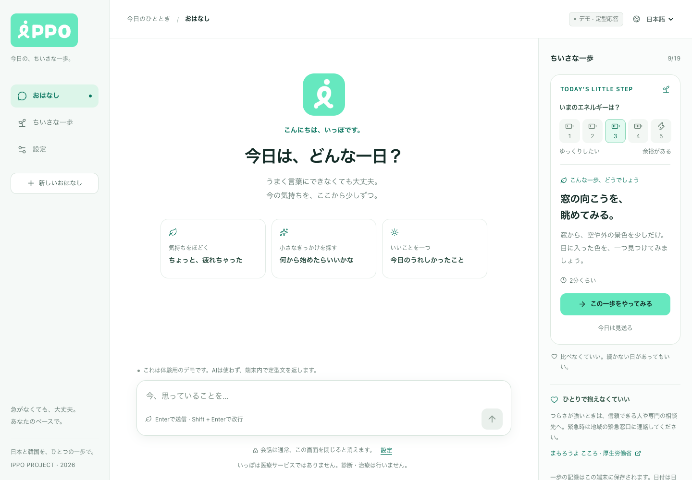
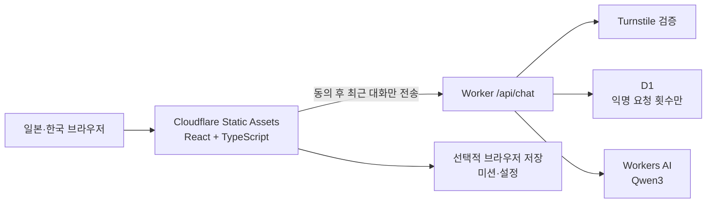

# IPPO · 잇포 · いっぽ

**오늘의 속도로, 작은 한 걸음. / きょうのペースで、小さな一歩。**

일본과 한국에서 사용할 수 있는 AI 대화 + 작은 일상 미션 앱의 초기 개발 저장소입니다. `IPPO`는 일본어 `一歩（いっぽ）`, 한 걸음을 뜻하는 작업명이며 상표·스토어 이름 확보는 아직 확인하지 않았습니다.

> **운영 주소:** [IPPO 열기](https://ippo.hyscodebase.workers.dev) — Cloudflare 서버리스에 배포했습니다. 실제 AI 답변 → 미션 제안 → 시작·완료 흐름을 확인했습니다. 로컬 기본 실행은 체험 모드입니다.



[한국어 모바일 화면](docs/preview-mobile.png) · [검증 기록](docs/validation.md) · [개발 이슈](https://github.com/IPPO-2026/ippo/issues)

## 지금 실행할 수 있는 것

- 설치형 PWA: 홈 화면 아이콘, 오프라인 미션, 새 버전 업데이트 안내
- 일본어·한국어 UI, UI 언어와 독립적인 일본·한국 도움 지역 선택
- 부담 없는 AI 대화 화면과 체험 답변, 실패·재시도 상태
- 대화 중 제안되는 작은 미션 카드, 시작·완료·미루기
- 대화·미션은 기본 메모리 보관, 브라우저 저장 선택·삭제
- 실제 AI 모드에서 전송 동의, Turnstile, 요청 길이·일일 횟수 제한

공개 주소는 실제 AI 모드로 동작합니다. 계정·클라우드 대화 동기화, 익명 동료 서클, 기관 대시보드, 탁상 디바이스는 이후 단계입니다. 치료·진단·자동 위기 판정을 제공하지 않습니다.

## 빠른 시작

```bash
npm ci
npm run dev
```

표시된 localhost 주소를 엽니다. Cloudflare 계정 없이 체험 모드로 동작합니다. 로컬 API까지 실행하려면:

```bash
npm run build
npm run dev:api
# 다른 터미널
npm run dev
```

Node.js 24 LTS를 권장합니다. 의존성은 `package-lock.json`으로 고정합니다.

```bash
npm run check                     # 타입 검사 + API/정책 테스트 + 프로덕션 빌드
npx wrangler deploy --dry-run     # 배포 번들 점검, 원격 배포하지 않음
```

화면 검증은 `npx playwright install chromium`과 `npm run build` 후 별도 터미널에서 `npm run dev:api`를 실행하고 `npm run test:ui`로 재현합니다. 1440/390 px에서 한·일 화면과 저장·삭제·문맥 미션을 점검하며 캡처는 Git 제외 폴더 `artifacts/`에 생성됩니다. 설치된 Chrome을 쓸 때는 `PLAYWRIGHT_CHROME_CHANNEL=chrome npm run test:ui`를 사용할 수 있습니다.

PWA 설치·오프라인·업데이트는 [앱 사용 안내](docs/pwa.md)를 확인하세요. `npm run build` 후 `npm run test:pwa`로 별도 서버 없이 검증할 수 있습니다. 개발용 Vite 화면에서는 서비스 워커를 등록하지 않습니다.

## 무료 운영 구조



Cloudflare **Workers Free** 플랜과 기본 `workers.dev` 주소를 사용합니다. 정적 자산 요청은 무료이며, AI는 계정 전체 **10,000 neurons/일** 범위입니다. 무료 플랜에서 할당량을 넘으면 호출이 실패합니다. 무제한 AI 대화나 상용 규모의 무상 운영을 보장하지 않습니다. [정적 자산 요금](https://developers.cloudflare.com/workers/static-assets/billing-and-limitations/), [AI 요금](https://developers.cloudflare.com/workers-ai/platform/pricing/)

초기 앱 제한은 전체 60회/일·IP별 6회/일입니다. 요금제 한도와 앱 제한은 다르며, 같은 Cloudflare 계정의 다른 서비스도 무료 AI 할당량을 함께 사용합니다. [배포 가이드와 비용 계산](docs/deployment.md)을 확인하세요.

[대화 중심 UI/UX와 호스팅 선택](docs/conversation-flow.md)

## 프로젝트 문서

| 문서 | 내용 |
|---|---|
| [제품 정의](docs/product.md) | 이름·대상·한일 UX·원안 대비 변경·수용 기준 |
| [브랜드 가이드](docs/brand.md) | 제공 로고 원본·민트 색상·타이포그래피·사용 규칙 |
| [아키텍처](docs/architecture.md) | 데이터 흐름·API·현재/향후 데이터 설계 |
| [무료 배포 가이드](docs/deployment.md) | 무료 한도·설정 순서·실제 AI 연결·운영 |
| [개발 로드맵](docs/roadmap.md) | 단계별 범위와 완료 조건 |
| [개인정보와 안전](docs/privacy-and-safety.md) | 전송·보관·삭제·한일 검토 과제 |
| [기여 가이드](CONTRIBUTING.md) | 개발·검증·PR 규칙 |
| [보안 보고](SECURITY.md) | 민감정보 없는 오류 보고 |

개발 작업은 [이슈 목록](https://github.com/IPPO-2026/ippo/issues)과 [마일스톤](https://github.com/IPPO-2026/ippo/milestones)에서 관리합니다. M1은 실제 AI 파일럿 준비, M2는 검증 후 확장입니다.

## 코드 구조

```text
src/                 React 화면, 한국어·일본어 문구, 로컬 상태
src/shared.ts        API 타입과 공통 길이 제한
worker/              채팅 API, 서버 정책, 무료 요청 예산
migrations/          D1 요청 카운터 스키마
tests/               입력 검증·무료 제한·AI 실패 처리 테스트
docs/                기획, 설계, 배포, 로드맵, 개인정보
.github/             CI, 이슈 양식, PR 양식
wrangler.jsonc       무과금 체험 배포 설정
wrangler.live.example.jsonc  실제 AI 배포 설정 예시
```

제공된 「곁걸음 GYEOT STEP 기능명세서, 2026-09-19」를 참고하되, 이번 프로젝트 요청의 **AI 채팅 중심 방향**을 우선했습니다. 원안의 비대화형 디바이스 요구는 현재 MVP에 적용하지 않습니다. 원본 전체는 공개 저장소에 재게시하지 않았습니다.

라이선스는 팀에서 선택 예정입니다. 공개 저장소라는 사실만으로 재배포나 상업 이용 라이선스를 부여하지 않습니다.

## 사용자 도메인

`ippo.kro.kr` 연결을 위한 Pages 설정을 준비했습니다. 현재 DNS 입력 대기 상태입니다. [DNS 입력값과 배포 방법](docs/custom-domain.md)을 확인하세요.
