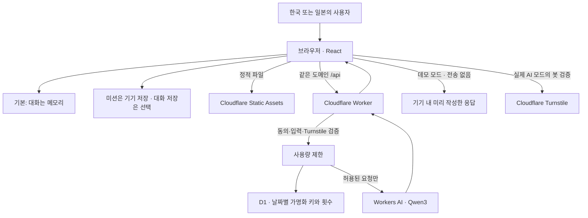
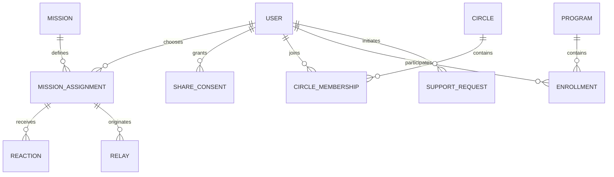

# 아키텍처와 무료 운영 범위

기준일: 2026-09-19. 아래는 초기 구현의 설계 기준이다. 실제 Cloudflare 계정 설정, 프로덕션 배포, 실제 모델 응답 검증은 별도 절차로 확인한다.

## 구성

React + TypeScript + Vite로 UI를 만들고, 하나의 Cloudflare Worker가 같은 도메인의 정적 파일과 `/api/*`를 제공한다. 서버에 대화 DB를 두지 않고 D1은 요청량 제한에만 사용한다.

정적 파일 경로는 Worker 실행이 필요 없도록 구성한다. API는 Worker에서 처리하며, 브라우저에 AI 인증 정보나 Turnstile 비밀 키를 전달하지 않는다. UI의 기본 데모는 기기 안에서 정해진 응답을 만들고 대화 원문을 전송하지 않는다. API에도 검증용 데모 응답 경로가 있지만 실제 모델은 호출하지 않는다. 실제 AI 설정이 빠졌을 때는 데모를 명확히 표시하거나 요청을 중단한다. 실제 AI 실패를 성공한 AI 응답처럼 바꾸어 표시하지 않는다.

## 요청 처리

1. 클라이언트는 UI 언어·이용 국가와 최근 대화를 준비한다. 외부 처리 동의를 확인한다.
2. 실제 AI 모드에서는 Turnstile 토큰을 포함한다. 서버도 동의 필드, 입력 형식, 허용 역할, 크기를 검증한다.
3. 서버는 Turnstile을 검증하고 요청 횟수를 확인한다. 운영 설정이나 검증에 문제가 있으면 AI 호출을 허용하지 않는다.
4. 허용 요청에만 서버가 정한 시스템 지침을 적용하여 `@cf/qwen/qwen3-30b-a3b-fp8`을 호출한다.
5. 응답을 UI에 전달한다. 앱 서버는 대화 원문을 DB나 애플리케이션 로그에 기록하지 않는다.

| 제약 | 초기 설정 | 목적 |
|---|---:|---|
| 사용자 메시지 길이 | 최대 1,000자 | 입력 크기 제한 |
| 모델에 전달하는 최근 문맥 | 최대 8개 메시지, 합계 3,200자 | 장시간 대화의 비용 증가 억제 |
| 모델 출력 | 최대 384 tokens | 짧은 응답과 비용 제한 |
| 추론 방식 | 시스템 지침에 `/no_think` | 간결한 대화 지향. 모델 동작 검증 필요 |
| IP 기준 호출 허용량 | 하루 6회 | 초기 공개 파일럿의 비용·남용 제한 |
| 앱 전체 호출 허용량 | 하루 60회 | 보수적 무료 운영 시작점 |

문자 수는 토큰 수가 아니다. 시스템 지침도 입력 토큰을 사용한다. 60회라는 설정은 비용 추정에 대한 여유이며, 무료 사용량을 수학적으로 보장하는 토큰 예산으로 해석하지 않는다. 실제 사용량을 확인한 뒤에만 한도를 조정한다.

## 현재 데이터 경계

| 데이터 | 저장·처리 위치 | 보존·삭제 기준 |
|---|---|---|
| 대화 | 기본: 브라우저 메모리 | 새로고침·페이지 종료 시 유실 가능 |
| 기기 저장을 선택한 최근 대화 | 해당 브라우저의 로컬 저장소 | 사용자 선택 시 최근 60개 메시지 보관. 삭제하거나 브라우저 데이터를 지울 때까지 |
| 오늘의 에너지·미션·상태·날짜 | 기본: 해당 브라우저의 로컬 저장소 | 화면에서 저장 사실 안내. 오늘의 상태를 유지하며 모든 기록 삭제 시 함께 제거 |
| 언어·국가·대화 저장 설정 | 해당 브라우저의 로컬 저장소 | 다음 방문의 설정 유지. 브라우저 사이트 데이터 삭제로 제거 가능 |
| 내보낸 기록 | 사용자가 내려받은 파일 | 사용자가 관리. 앱 삭제로 다운로드 파일까지 지워지지는 않음 |
| 실제 AI 요청의 최근 대화·언어·국가 | Worker 및 AI 제공자에서 처리 | IPPO 앱 DB에 저장하지 않음. 제공자 처리는 별도 정책 확인 대상 |
| 요청량 제한 키와 횟수 | D1 | 날짜별 HMAC 가명화 키·횟수. UTC 기록일의 이틀 뒤 00:00를 만료 시각으로 두고 예약 작업에서 만료 항목 정리 |
| 접속·보안 메타데이터 | 호스팅·보안 제공자 | 제공자 정책·운영 설정 확인 필요 |

IP 주소 원문 대신 서버 비밀 키로 `날짜 + IP`를 HMAC 처리한 키를 D1 요청량 제한에 사용한다. 날짜가 달라지면 키도 바뀐다. 호스팅 제공자는 접속 시 IP 원문을 처리하며, Worker도 Cloudflare가 제공한 IP를 읽고 Turnstile 검증의 `remoteip`로 전달한다. D1에 IP 원문을 저장하지 않는다는 사실을 IP 원문이 어디에서도 처리되지 않는다는 의미로 해석하지 않는다. 같은 회사·학교·가정의 공인 IP를 공유하면 한도도 공유될 수 있고, IP 변경 사용자를 하나로 식별할 수 없다. 글로벌 한도가 추가 안전장치다.

로컬 저장소는 암호화된 개인 금고가 아니다. 공용 브라우저에서는 기록을 다른 사용자가 볼 수 있다. 설정의 모든 기록 삭제는 대화·미션 기록을 함께 초기화하며, 이미 내려받은 내보내기 파일은 사용자가 별도로 삭제해야 한다.

미션의 날짜는 선택한 국가의 현지 날짜이고 API 일일 한도는 UTC를 기준으로 한다. 한국·일본에서 UTC 날짜 전환은 오전 9시이므로 자정 미션 변경과 API 한도 초기화가 일치하지 않는다.

## 무료 운영의 조건

2026-09-19 공식 문서 기준 정적 자산 요청은 무료·무제한이며, Workers Free API는 계정당 하루 100,000 요청, Workers AI는 계정당 하루 10,000 neurons를 제공한다. D1 Free는 하루 500만 rows read·10만 rows written, 계정 저장량 5 GB 범위다. 무료 계정의 각 한도와 제품별 제한을 함께 적용한다. [Static Assets](https://developers.cloudflare.com/workers/static-assets/billing-and-limitations/), [Workers](https://developers.cloudflare.com/workers/platform/limits/), [Workers AI](https://developers.cloudflare.com/workers-ai/platform/pricing/), [D1](https://developers.cloudflare.com/d1/platform/pricing/)

- 실제 AI의 무료 한도는 계정의 다른 AI 작업과 공유한다. 요청 횟수와 neurons 사용량은 같은 단위가 아니다.
- 무료 플랜 한도 도달 시 호출을 중단한다. 자동 유료 업그레이드나 다른 유료 모델로의 자동 우회는 구성하지 않는다.
- 무료 호스팅과 무제한 무료 AI는 다르다. 정적 화면과 로컬 미션이 사용 가능하더라도 AI 호출은 거절될 수 있다.
- 도메인을 구매하지 않고 제공받는 호스트 주소로 시작할 수 있다. 사용자 소유 도메인 구매 비용은 이 설계에 포함하지 않는다.
- D1 한도·장애, Turnstile 실패, AI 오류 시 제한을 생략하고 모델을 호출하지 않는다. UI에 재시도 또는 다음 한도 초기화를 안내한다.

Qwen 공식 자료는 한국어·일본어 지원을 포함하지만 이 앱의 답변 정확성·적합성을 보장하지 않는다. 모델 교체 시 양 언어 평가와 비용 계산을 다시 수행한다. [Qwen3](https://qwenlm.github.io/blog/qwen3/), [Workers AI 모델](https://developers.cloudflare.com/workers-ai/models/qwen3-30b-a3b-fp8/)

## 이후 관계형 모델 — 설계 제안만 존재

아래는 계정·공유 기능을 채택할 경우 검토할 엔터티다. **현재 D1 마이그레이션에 대화·사용자·기관 테이블이 구현되어 있다는 의미가 아니다.**

| 엔터티 | 후속 설계에서 정할 사항 |
|---|---|
| USER | 인증·연령 정책·복구·탈퇴와 최소 프로필 |
| MISSION / MISSION_ASSIGNMENT | 미션 버전, 국가별 표현, 제안 날짜와 본인 상태 기록 |
| SHARE_CONSENT | 대상·목적·범위·문구 버전·동의·철회 시각 |
| CIRCLE / CIRCLE_MEMBERSHIP | 배정 기준, 접근 통제, 탈퇴와 소수 집단 재식별 방지 |
| REACTION / RELAY | 허용 반응, 중복 방지, 연결 해제와 신고 처리 |
| PROGRAM / ENROLLMENT | 기관별 데이터 분리와 역할별 접근 권한 |
| SUPPORT_REQUEST | 요청 대상, 전달·확인 상태, 실제 운영자의 책임과 응답 가능 시간 |

서버 대화 보관은 별도 제품 결정으로 남긴다. 필요성, 보존 기간, 열람·삭제·수출, 운영자 접근, 국가 간 처리 조건을 정하기 전에는 대화 테이블을 추가하지 않는다.
